<h1 align=center>
	<b>Net_Practice</b>
</h1>

<h2 align=center>
	<i>42cursus' project #10</i>
</h2>

	The <b>net_practice</b> project is our first networking related project in 42 curriculum. It consists in 10 exercises in which we should configure different small-scale networks into communicating with each other - all of them using the concepts learnt about TCP/IP addressing.

---

<h2>
	Final score
</h2>

<h4>Completed</h4>

---

<h2 align=center> Index </h2>
<h3 align="center"><b>
	<a href="#Network">What is a Network?</a>
	 • 
	<a href="#TCP">What is TCP and IP Adress?</a>
	 • 
	<a href="#IPv4">IPv4 and Subnet Masks</a>
	 • 
	<a href="#Connecting">Connecting multiple devices</a>
	 • 
	<a href="#Switch">Switch</a>
	 • 
	<a href="#Router">Router</a>
	 • 
	<a href="#RouterTable">Routing Table</a>
	 • 
	<a href="#NetPractice">Net Practice</a>
</b></h3>

---

# First things first...

<h2 id="Network">
What is a Network?
</h2>

In simple terms, a **Network** in computing is a group of two or more devices that can communicate amongst each other. By communicating we mean the possibility of **sending** and **receiving** data (or *packets*) - beetween different devices (or *nodes*).

The **Internet** is one of many examples of a network. It is probably the biggest network in the world, and connects many different nodes, making the sharing of data available between devices located anywhere in the world.

The Internet is considered a **Public Network**. A Public Network allows for data transfer between any device connected to it, with no or very little control access. Usually, it is operated by a telecommunications company for the specific purpose of providing data transmission services to the public.

On the other hand, we also have **Private Networks**. A Private Network allows for communication between devices that are restricted to a specific location or domain. The data transfer is not allowed for anyone unregistered, making it a much safer and controled environment. A Home Network is an example of private network. In there, you can connect to your personal printer when no one who isn't connected to your house's Wi-Fi, for example, could.

<h2 id="TCP">
What is TCP and IP Adress?
</h2>

In order to transfer data from one point to another across a network, many different types of protocols exist to ensure access, transport, security and stability. All these protocols work together, each one responsible for what we call a "layer" in the communication process.

**Transmission Control Protocol** (or **TCP**) is a communication standard protocol that enables nodes to communicate with each other. TCP is responsable for "breaking" data into small pieces (or packets), sending them over the network and then "rebuilding" them all back again while ensuring there is no data lost in the process.

And how does it know where to send those pieces to? It does so utilizing an **Internet Protocol Address** (or **IP Adress**), which is a series of numbers used to identify any device connected to a network, either public or private.

TCP and IP are not the same thing, but rather **two separated protocols** that work together in order ensure data transfer between different devices.

There are two different version of IP Addresses: **IPv4** and **IPv6**. For the purpose of this project, we will only need to know about IPv4, the oldest and more broadly used protocol model. From now on, in this guide, we will use the terms IP and IPv4 interchangeably.

<h2 id="IPv4">
IPv4 and Subnet Masks
</h2>

An IPv4 address is a 32-bit number divided into four 8-bit blocks.

Each of theses blocks range from `0` to `255` or, in binary, `00000000` to `11111111`.

It is fundamental to learn how to visualize each IP Address in its binary form. The reason for it is the fact that every IP Address can be split into two separete pieces of information: the **Network** and the **Host** address.

The portion corresponded to the **Network Address** is the identifier of the network in which the devices are connected. In order to communicate with each other, the nodes must be all in the same network, therefore, have the same Network Address portion of their respective IPs.

The portion corresponded to the **Host Address** is the individual identifier of the device. Each node in the same network must have a singular, unique Host Address.

In order to identify which part of the full IP Address correspond to the Network and which correspond to the Host, we musk apply to it a **Network Mask** (or **Subnet Mask**).

A Mask is also a 32-bit number divided into four 8-bit blocks. However, its purpose is to identify which bits are actively part of the Network identification. To do so, it marks with 1s the network bits.

There are two ways to represent a mask: by a full IP Mask or by CIDR.

Let's look at an example:

	IP Address:		153.172.250.12
	Subnet Mask:	255.255.255.0
	CIDR:			/24

In binary, respectively, we have:

	IP Address:		10011001.10101100.11111010.00001100
	Subnet Mask:	11111111.11111111.11111111.00000000

According to the mask, the first 24-bits are marked as part of the Network Address. That means that the first 24-bits of the IP Address represent the Network Address.

	Network Address:	10011001.10101100.11111010.????????
	or:					153.172.250.?
	IP/CIDR:			153.172.250.12/24

In practical terms, we can say that any device with IPs ranging from `192.172.250.0` to `192.172.250.255` are in the same network and can, therefore, communicate with each other freely.

Let's look at another example:

	IP Address:		153.172.175.12
	Subnet Mask:	255.255.240.0
	CIDR:			/20

In binary, respectively, we have:

	IP Address:		10011001.10101100.10101111.00001100
	Subnet Mask:	11111111.11111111.11110000.00000000

According to the mask, now the first 20-bits are marked as part of the Network Address. That means that the first 20-bits of the IP Address represent the Network Address.

	Network Address:	10011001.10101100.1010????.????????
	or:					153.172.(160-175).(0-255)
	IP/CIDR:			153.172.175.12/20

In practical terms, we can say that any device with IPs ranging from `192.172.160.0` to `192.172.175.255` are in the same network and can, therefore, communicate with each other freely.

It's important to notice that in the network mask, when reading it from left to right, once a `zero` appears, the mask will be completed with only zeros. That means `255.255.240.0` is a valid mask, but `255.255.240.128` isn't.
For masks, there a only nine possible 8-bit blocks:

	0 0 0 0 0 0 0 0 ->	0 
	1 0 0 0 0 0 0 0 ->	128
	1 1 0 0 0 0 0 0 ->	192
	1 1 1 0 0 0 0 0 ->	224
	1 1 1 1 0 0 0 0 ->	240
	1 1 1 1 1 0 0 0 ->	248
	1 1 1 1 1 1 0 0 ->	252
	1 1 1 1 1 1 1 0 ->	254
	1 1 1 1 1 1 1 1 ->	255

However, something else that is important to understand is that, in this process of dividing a larger network into smaller ones or, subnets, we must reserve 2 IP addresses that cannot be used by any device.

The **first IP in the range** is reserved to identify the subnet.

The **last IP in the range** is reserved for broadcasting messages across all devices in the subnet.

In the first example, the IPs `192.172.250.0` and `192.172.250.255` would be reserved. So, only the IPs from `192.172.250.1` to `192.172.250.254` could be assigned for other devices.

That means, in practical terms, that we must choose network masks carefully, having in mind how many devices you plan to connect to your network.

| CIDR | SUBNET MASK | WILDCARD MASK | # OF IP ADDRESSES | # OF USABLE IP ADDRESSES |
|------|-------------|---------------|-------------------|-------------------|
| /32 |	255.255.255.255 |	0.0.0.0 |	1	| 1
| /31 |	255.255.255.254 |	0.0.0.1 |	2	| 2
| /30 |	255.255.255.252 |	0.0.0.3 |	4	| 2
| /29 |	255.255.255.248 |	0.0.0.7 |	8	| 6
| /28 |	255.255.255.240 |	0.0.0.15 |	16	| 14
| /27 |	255.255.255.224 |	0.0.0.31 |	32	| 30
| /26 |	255.255.255.192 |	0.0.0.63 |	64 	| 62
| /25 |	255.255.255.128 |	0.0.0.127 |	128 | 126
| /24 |	255.255.255.0 |	0.0.0.255 |	256	| 254
| /23 |	255.255.254.0 |	0.0.1.255 |	512	| 510
| /22 |	255.255.252.0 |	0.0.3.255 |	1,024 |	1,022
| /21 |	255.255.248.0 |	0.0.7.255 |	2,048 |	2,046
| /20 |	255.255.240.0 |	0.0.15.255 |	4,096	| 4,094
| /19 |	255.255.224.0 |	0.0.31.255 |	8,192	| 8,190
| /18 |	255.255.192.0 |	0.0.63.255 |	16,384	| 16,382
| /17 |	255.255.128.0 |	0.0.127.255 |	32,768	| 32,766
| /16 |	255.255.0.0 |	0.0.255.255 |	65,536	| 65,534
| /15 |	255.254.0.0 |	0.1.255.255 |	131,072	| 131,070
| /14 |	255.252.0.0 |	0.3.255.255 |	262,144	| 262,142
| /13 |	255.248.0.0 |	0.7.255.255 |	524,288	| 524,286
| /12 |	255.240.0.0 |	0.15.255.255 |	1,048,576 |	1,048,574
| /11 |	255.224.0.0 |	0.31.255.255 |	2,097,152 |	2,097,150
| /10 |	255.192.0.0 |	0.63.255.255 |	4,194,304 |	4,194,302
| /9 |	255.128.0.0 |	0.127.255.255 |	8,388,608 |	8,388,606
| /8 |	255.0.0.0 |	0.255.255.255 |	16,777,216	|16,777,214
| /7 |	254.0.0.0 |	1.255.255.255 |	33,554,432	|33,554,430
| /6 |	252.0.0.0 |	3.255.255.255 |	67,108,864	|67,108,862
| /5 |	248.0.0.0 |	7.255.255.255 |	134,217,728	|134,217,726
| /4 |	240.0.0.0 |	15.255.255.255 |	268,435,456 |	268,435,454
| /3 |	224.0.0.0 |	31.255.255.255 |	536,870,912 |	536,870,910
| /2 |	192.0.0.0 |	63.255.255.255 |	1,073,741,824 |	1,073,741,822
| /1 |	128.0.0.0 |	127.255.255.255 |	2,147,483,648 |	2,147,483,646
| /0 |	0.0.0.0 |	255.255.255.255 |	4,294,967,296 |	4,294,967,294

<h2 id="Connecting">
Connecting multiple devices
</h2>

As it was previously said, Public Networks like the **Internet** are estabilished by some telecommunication provider in order to connect devices from all around the globe.

A **Public IP Address** is assigned by your **Internet Service Provider** (or **ISP**), directly into your personal **router**, and allows connectivity directly to your personal, private network.

Your private network is established by a **switch** located inside the router provided to you by your ISP. Your router is responsible for assigning a **Private IP Address** directly to any device connected to your private network, following the previously mentioned rules regarding subnet masks and IPs.

There are some IP addresses that are reserved for specific uses. Therefore, when assigning a IP Address inside of a network connected to the internet, you must pay attention to the list below:

IP  Address Range | Reserved  |
----------------------|-----------|
10.0.0.0 - 10.255.255.255 | reserved for private IPs (Class A)
127.0.0.0 - 127.255.255.255 | reserved for loopback and internal testing
172.16.0.0 - 172.31.255 | reserved for private IPs (Class B)
192.168.0.0 - 192.168.0.0 | reserved for private IPs (Class C)
224.0.0.0 – 239.255.255.255 | reserved  for  multicast
240.0.0.0 – 255.255.255.255 | reserved for experimental, used for research

<h3 id="Switch">
Switch
</h3>

A network **switch** is responsible for distributing packets between devices within the same network - usually, a local one (called LAN). A switch does not have any interface and it cannot talk to a network outside of its own.

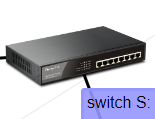

<h3 id="Router">
Router
</h3>

A **router** is responsible for connecting multiple networks together. Every router has an interface for every network it connects it to.

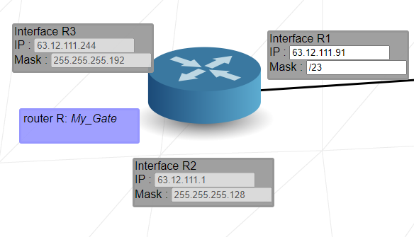

Since it connects multiple networks together, the range of possible IP addresses on one of its interfaces must never overlap the range of its other interfaces. An overlap of ranges would imply the interfaces belong to the same network.

<h3 id="RouterTable">
Routing Table
</h3>

A **Routing Table** is a simple data table stored in a router or network host that lists all the routes to a particular network destination.

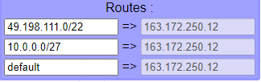

In Net Practice, a routing table consists of only two simple informations:

- **Destination** (on the left): it's the IP address that you want to send a package to, combined with the CIDR of that network: 190.3.2.252/30. If you don't want to specify a destination, or you want to make it available for the entire network, you can just set it to default or 0.0.0.0/0.

- **Next Hop** (on the right): it's the IP address of the next router that you need to send the packages to in order to reach the destination-network.

<h1 id="NetPractice">
Net Practice
</h1>

  
Level 1

   
  
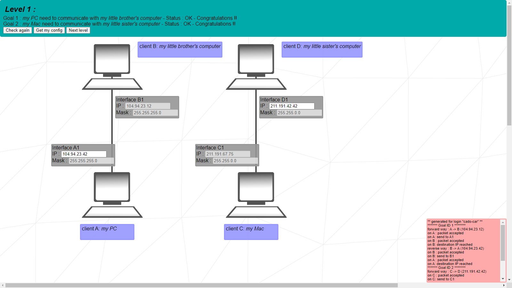

The first exercise on the list is a simple problem of direct communication between each 2 devices. You need to make sure that each two devices that need to communicate between each other are, in fact, in the same network.

For Client A and Client B, who have both have subnet masks of `255.255.255.0` or CIDR `/24`, you need to make sure that the IP Address for A matches the same Network from B, which is `104.94.23.0/24`. That means Client A IP Address can be from range `104.94.23.1` from ``104.94.23.254` (remembering the extremities from the range are reserved for network and broadcast, respectively).

For Client C and Client D, the same rule applies, but now they both have subnet masks of `255.255.0.0` or CIDR `/16`. Therefore, you need to make sure that the IP Address for D matches the same Network fromC, which is `211.191.0.0/16`. That means Client D IP Address can be from range `211.191.0.1` from ``211.191.255.254`.

---

  
Level 2

   

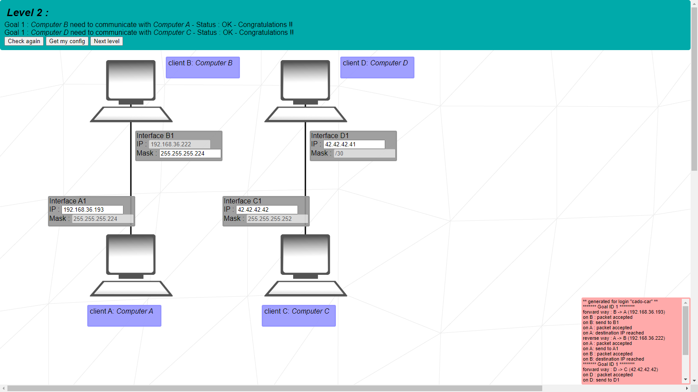

For this level, it's important to keep a few things in mind.

First, it's the necessity for all devices in the same network to have the same mask.

Second, you cannot use reserved IPs for private addresses that are not specific for this use.

For the connection between Client A and Client B, both of them must have the same mask `255.255.255.224`, or CIDR `/27`. Since the IP Address for Client B is already set in `192.168.36.222`, then you can infer that the network range is between `192.168.36.192` and `192.168.36.223`, extremities excluded. Client A can be anywhere within this range.

For CLient C and Client D, however, we have a mask of `255.255.255.252`, or CIDR `/30`. For this mask, we only have 4 IPs in range, and only 2 available for use. When you choose the IPs for them, you must make sure they are not reserved, and that the 2 last bits are not all 0s (first in range) nor all 1s (reserved for broadcast).

---

  
Level 3

   

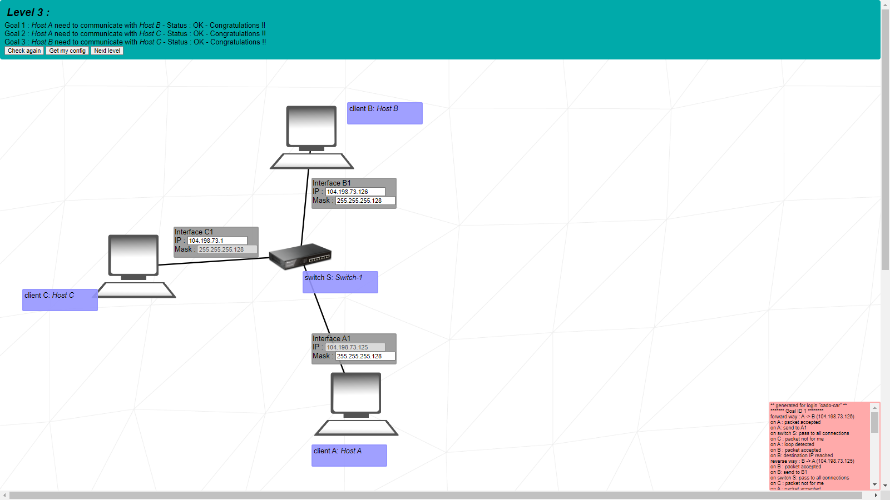

This is the first contact we have with switches. Its use is quite similar to the previous exercises, the only difference now beeing the possibility of communication between 3 separate devices.

All 3 clients must be on the same network. The mask for Client C is set as `255.255.255.128`, or CIDR `/25`. Therefore, this will be the mask for every other host. And the IP Address for Client A is set on `104.198.73.125`, so we can also infer that the range for this particular network can only be from `104.198.73.0` and `104.198.73.127`, extremities excluded.

---

  
Level 4

   

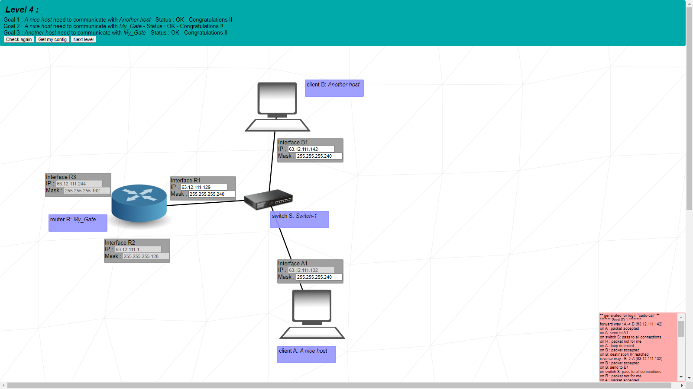

This exercise introduces the concept of a router. This router in particular has 3 separate interfaces, each with an IP Address and a Subnet Mask.

When choosing the IP Address and Mask for the router R **Interface R1**, you must make sure that there are no overlaps of IP ranges between interfaces.

**Interface R2**, for example, has a range of IPs from `63.12.111.0` and `63.12.111.127`, while **Interface R3** has a range from `63.12.111.192` and `63.12.111.255`. Therefore, you must make sure the mask you choose for this particular network will not cause it to share any of those IPs.

To do so, take a look at the IP Address from Client A, set in `63.12.111.132`. This IP is located exactly in between the ranges previously mentioned. There are only 63 possible addresses in this area (`63.12.111.128` - `63.12.111.191`), so you can use a mask of CIDR `/27` or above. I chose a mask of `255.255.255.240`, or CIDR `/28`, for reassurence.

Applying this mask on the IP Address of Client A, we have the range from `63.12.111.128` to `63.12.111.143`, extremities excluded, all the while making sure there are no overlaps in router R.

---

  
Level 5

   

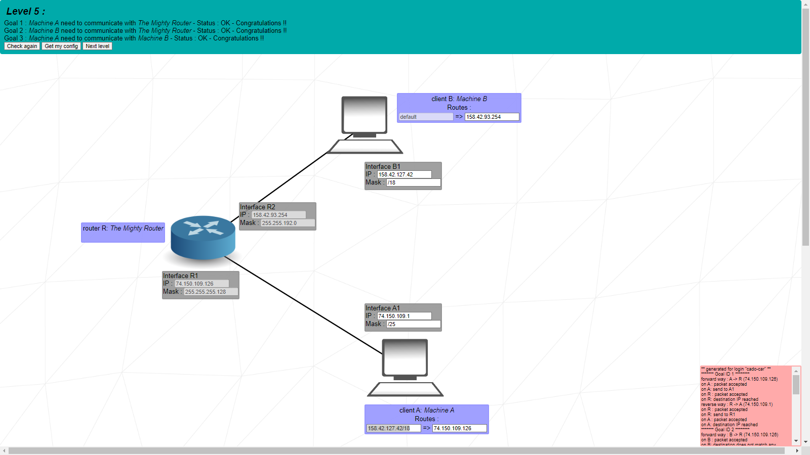

In this exercise, a Routing Table is introduced for the first time. The idea here is that each host must have a routing table that can connect to the router and each other.

First, let's start stablishing the IP addresses and Mask for each host.

Client A must be located on the same network as Interface R1. To do so, it must share the same mask `255.255.255.128` or CIDR `/25` and must be in the range of Addresses between `74.150.109.0` and `74.150.109.127`, extremities excluded.

Client B must be located on the same network as Interface R2. To do so, it must share the same mask `255.255.192.0` or CIDR `/18` and must be in the range of Addresses between `158.42.64.0` and `158.42.127.255`, extremities excluded.

Now, let's configure the routing tables. For client A, you must set it up in a way that it can allow communication with client B. To do so, you have two options: either you point out the destination IP as the address for client B (`158.42.127.42/18`), or you leave it at **default** (`0.0.0.0/0`).

The next hop for both tables will be the IP address of the respective router R Interface - the closest point of connection will allow for the communication to establish.

---

  
Level 6

   

This level introduces the concept of the Internet.

The Internet is simply a sort-of-router that has many interfaces in which it can connect. The purpose for this exercise is to connect client A all the all to the Internet.

First, let's set all IP Addresses and Masks. For client A and router R's Interface R1, which are in the same local network via switch, we must set them with the same mask `255.255.255.128` or CIDR `/25`.

Interface R1 must have an IP in the range of `45.149.96.128` and `45.149.96.255`, extremities excluded.

Now, for the routing tables, we must have in mind that we must connect client A to the Internet and vice-versa.

Client A route destination must be the **Interface Somewhere on the Net**, witch is `8.8.8.8/16` or **default**. The next hop for this table is the router R's Interface R1 IP, `45.149.96.254`, the next logical step to connect to the Internet.

Internet I route destination must be the Interface A1 IP, which is `45.149.96.227/25`, of simply **default**., since the next hop for this route is the Router R's Interface R2.

The router R routing table, however, has a next hop which doesn't match any Interface IP in the schema, so you can set it's destination to **default**, since it won't impact the other connections.

---

  
Level 7

   

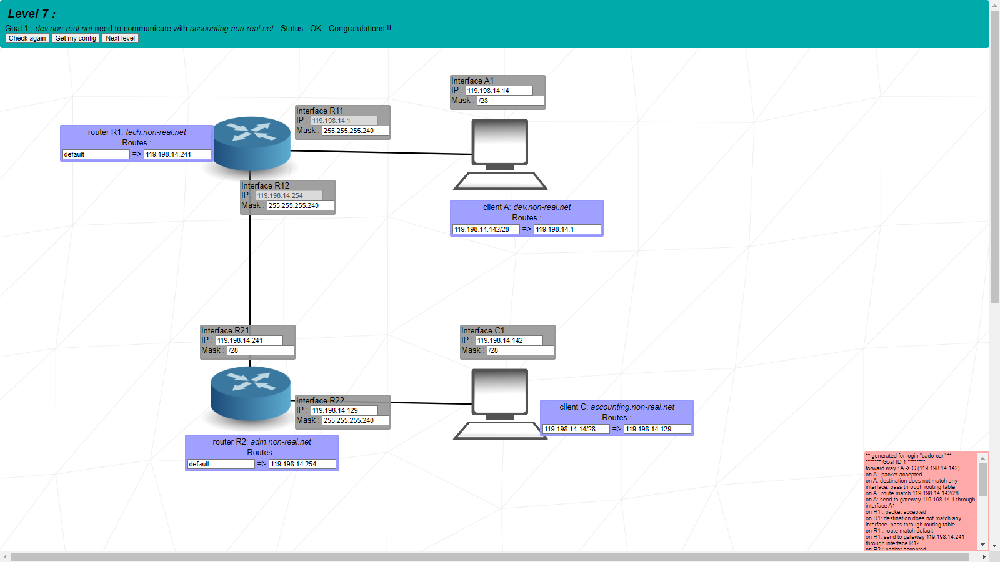

---

  
Level 8

   

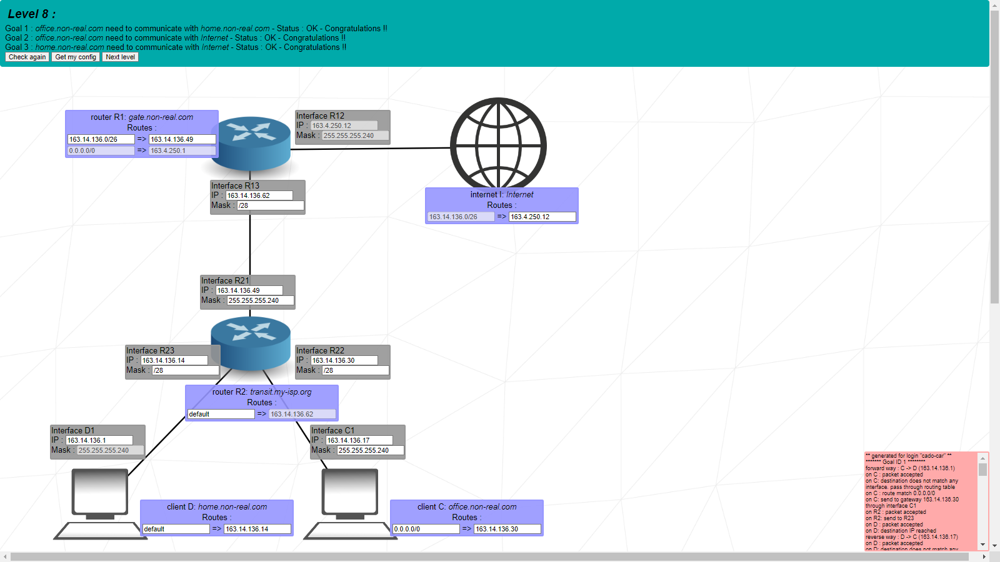

---

  
Level 9

   

---

  
Level 10

   

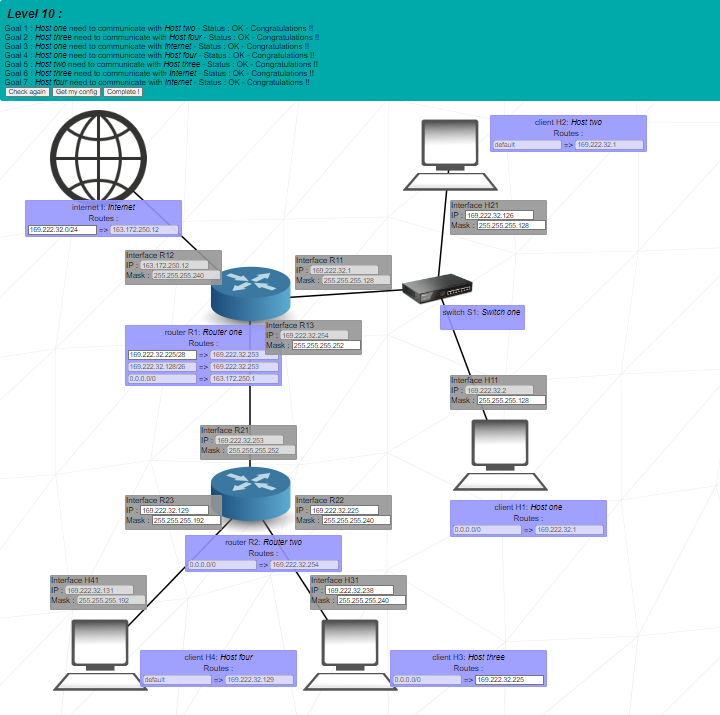

